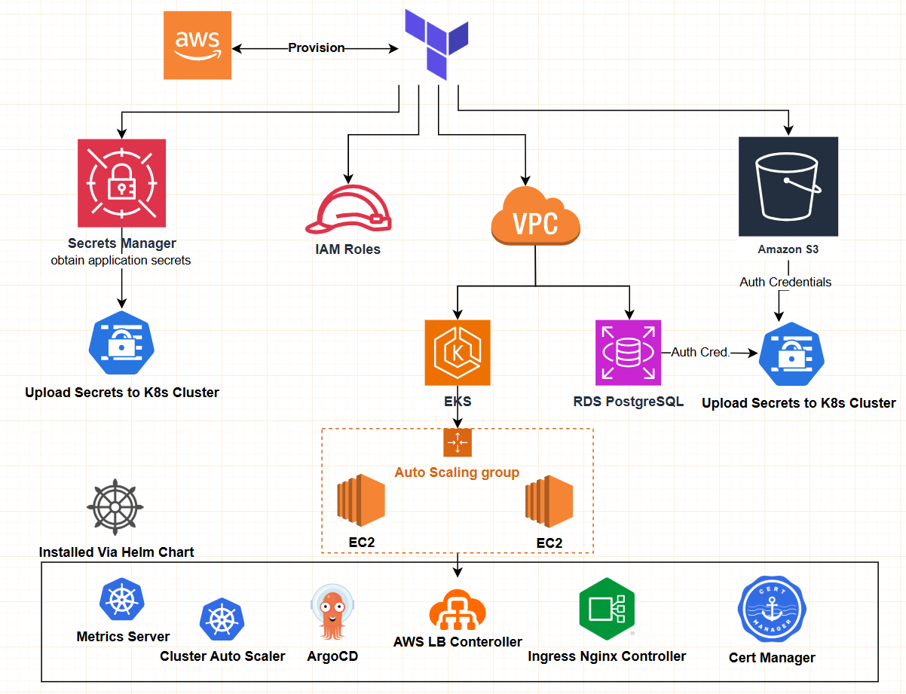
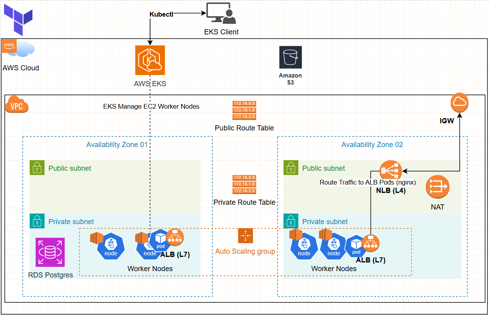
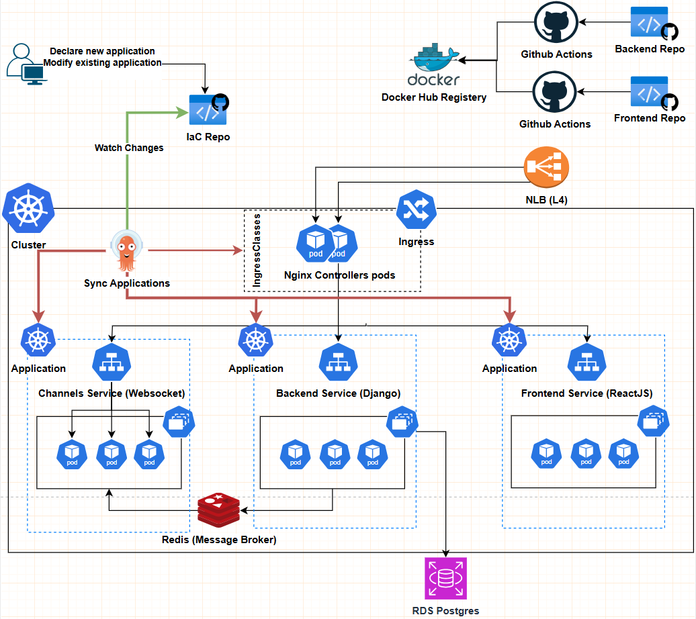

# Deploy EKS Cluster using Terraform and ArgoCD

## Overview
This repository contains the terraform code to deploy EKS cluster, S3, RDS and ArgoCD App for (Light Messages Demo). 

- Backend Repository: [Light Messages Backend](https://github.com/abdelslam1997/light_messages_backend)
- Frontend Repository: [Light Messages Frontend](https://github.com/abdelslam1997/light_messages_frontend)

`We are using ArgoCD to deploy the backend and frontend applications to the EKS cluster. this repository contains IaC and ArgoCD App for the backend and frontend applications.`

### Terraform Architecture Overview


### AWS Architecture Overview


### Cluster Architecture Overview


**`Feel free to fork and modify the code to suit your needs`**

## Prerequisites
- WSL terminal (if you are using windows)
- AWS IAM User Account
- AWS CLI
- kubectl
- Terraform
- **If you wish to try the deployment of (Light Messages Demo) you need to have the following:**
  - Clone the `backend` and `frontend` and `IaC` repositories
  - `If you want to keep your IaC repo private`, you need to create `ssh key` and add it to your github IaC repo in Deploy Keys section (Settings > Deploy Keys)
  - Upload your ssh key to AWS Secret Manager and Add secret_arn to .env file variable `TF_VAR_ssh_server_key_secret_arn` Terraform will upload the secret to the EKS cluster and argocd will use it to access the IaC repository.
  - Add backend environment variables to secrets in AWS Secret Manager and add the secret_arn to .env file variable `TF_VAR_backend_secrets_secret_arn` Terraform will upload the secret to the EKS cluster and argocd will use it to deploy the backend application.
  - Create a docker images (Backend, Frontend) and push it into your docker hub account
  - Update repoURL in `./apps/` directory to match your repositories
  - Update the `./k8s/production` images to match your docker images


## Deploy EKS Cluster using Terraform and ArgoCD

### 1. Make sure you make `.env` file as `.env.example` and update the values

### 2. Set environment variables
```bash
cd terraform
source .env
```

### 3. Check your aws credentials is valid
```bash
aws sts get-caller-identity
```

### 4. Deploy Infrastructure using Terraform (VPC + EKS Cluster + ArgoCD + S3 + RDS)
```bash
./apply.sh
```

### 5. Connect to aws eks cluster using kubectl
```bash
aws eks --region <aws_region> update-kubeconfig --name <eks_cluster_name>
```

## Connect to ArgoCD

### 1. Check if argocd is running
```bash
# Check if argocd namespace exists
kubectl get namespace argocd
# Check if argocd pods are running
kubectl get pods -n argocd  
```

### 2. Get ArgoCD Login Password
- Using Terraform Output
```bash
cd eks_cluster
terraform output argocd_secret_initial_admin_password
````
- Or using kubectl command
```bash
# Get argocd password
kubectl -n argocd get secret argocd-initial-admin-secret -o jsonpath="{.data.password}" | base64 --decode
```

### 3. Port forward to argocd server
```bash
kubectl port-forward svc/argocd-server -n argocd 8080:80 &
```
### 4. Access argocd server
- URL: http://localhost:8080
- **Username:** admin
- **Password:** `From step above: 2. Get ArgoCD Login Password `